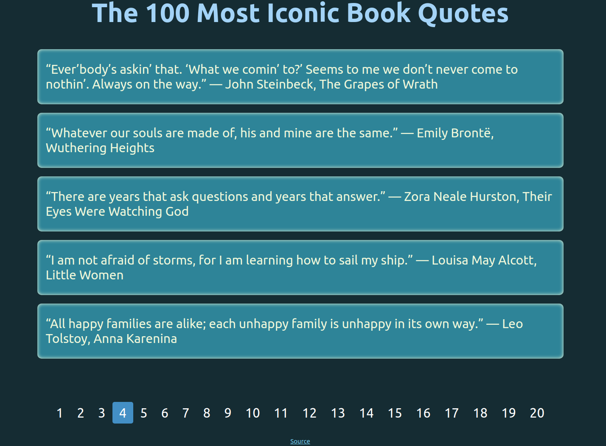

# Simple pagination

If you have a website with lots of pages, you may wish to add a pagination to each page. This project was created to show 5 of The 100 Most Iconic Book Quotes on one page. I highlighted the current page with an `.Active` class. Also, I implemented throbber.

Below is how the result looks like.

